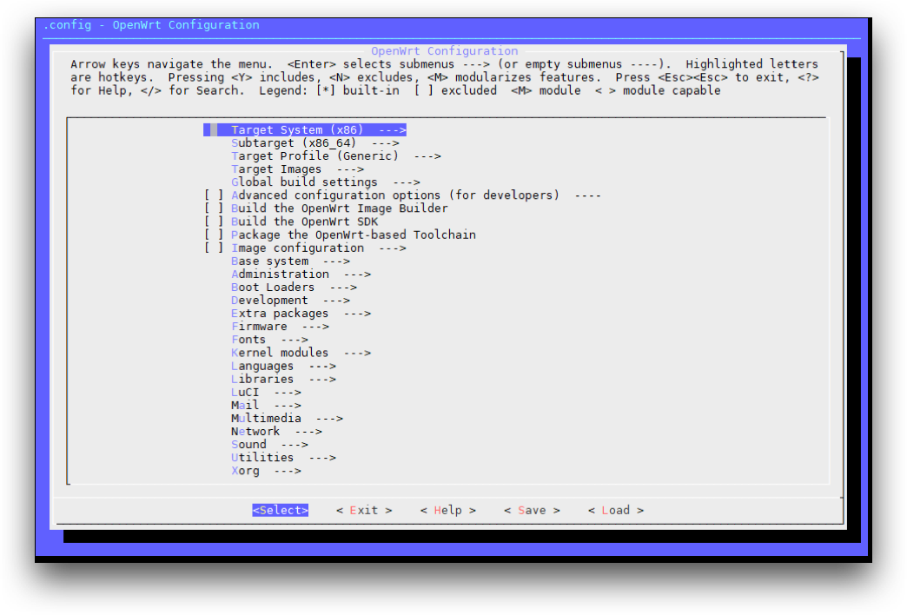
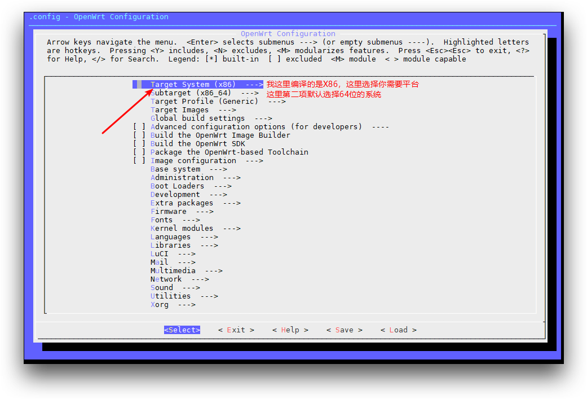
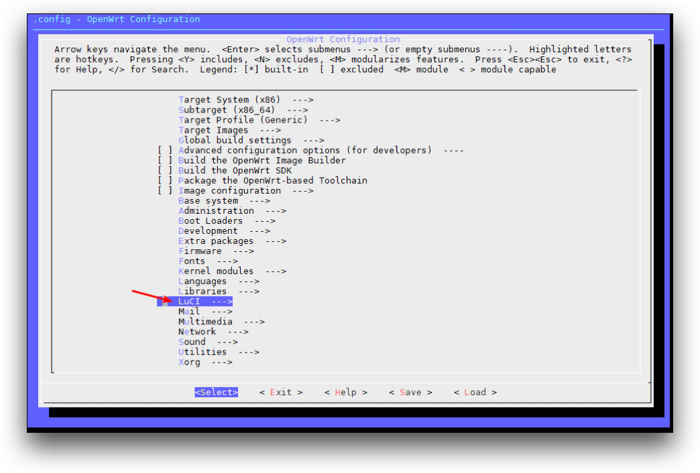
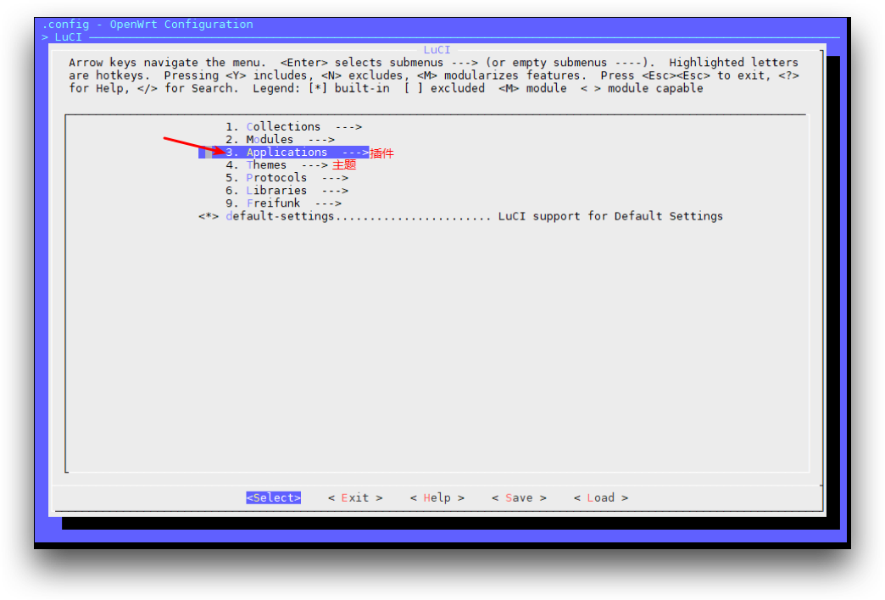
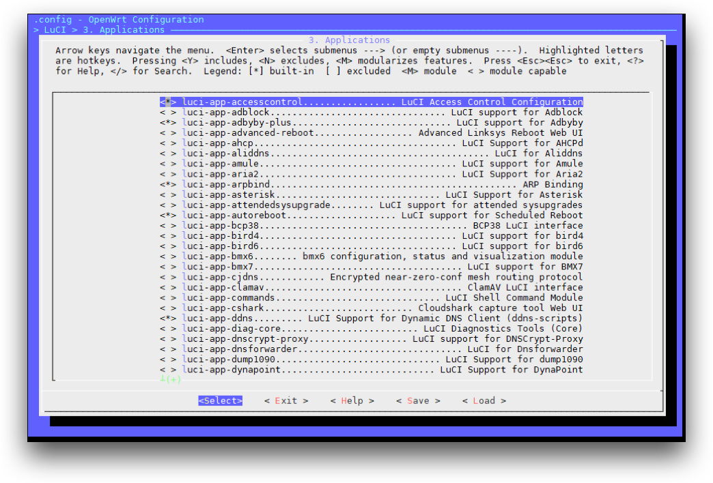
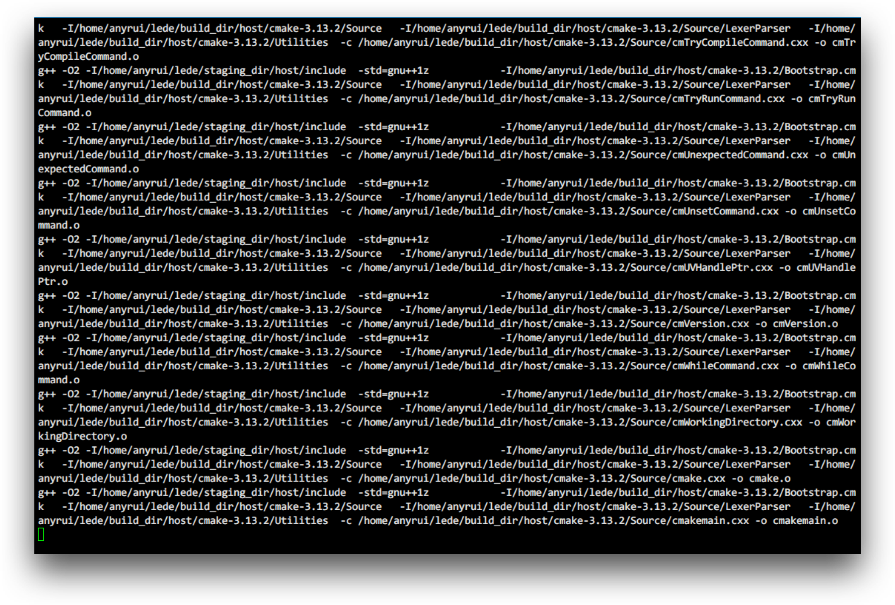
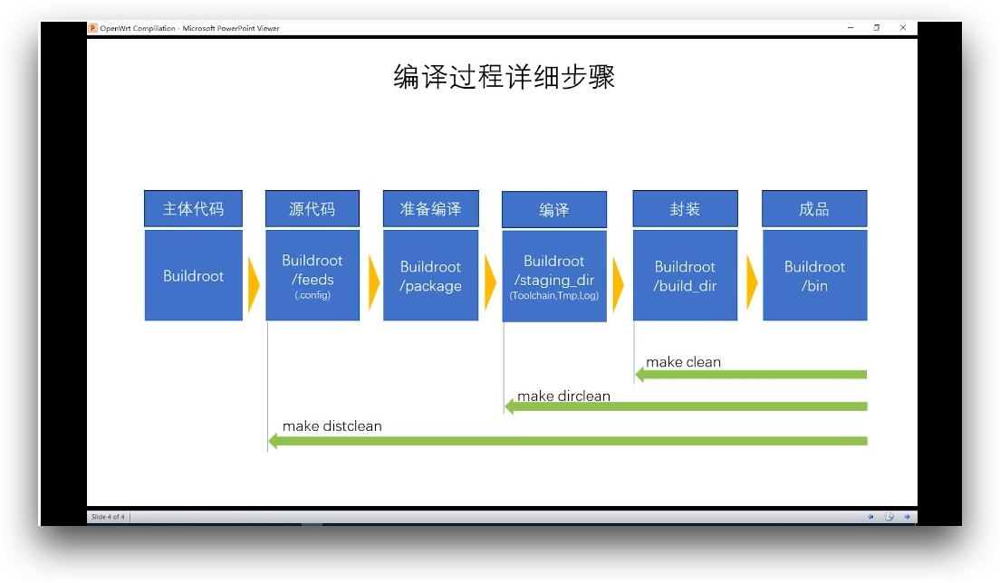

## 注意：
> - 不要用 root 用户进行编译！！！
- 国内用户编译前最好准备好梯子
- 默认登陆IP 192.168.2.1 密码 password
- 首先装好 Ubuntu 64bit，推荐 Ubuntu 20.04 LTS x64

## 安装必备组件
命令行输入 `sudo apt-get update` ，然后输入
```asp
sudo apt-get -y install build-essential asciidoc binutils bzip2 gawk gettext git libncurses5-dev libz-dev patch python3 python2.7 unzip zlib1g-dev lib32gcc1 libc6-dev-i386 subversion flex uglifyjs git-core gcc-multilib p7zip p7zip-full msmtp libssl-dev texinfo libglib2.0-dev xmlto qemu-utils upx libelf-dev autoconf automake libtool autopoint device-tree-compiler g++-multilib antlr3 gperf wget curl swig rsync
```
## 开始编译
`git clone https://github.com/coolsnowwolf/lede `
命令下载好源代码，然后 ***cd lede* **进入目录
配置编译
```java
./scripts/feeds update -a
./scripts/feeds install -a
make menuconfig
```
之后进入如下界面，这实际上是一个配置界面，用来配置编译的配置，并不是编译的过程。
如果更新不成，执行 `make distclean `命令恢复，重新执行更新和安装命令，直至更新100%成功。

进

入Target System和Subtarget勾选需要编译的平台。

进

入Target Images勾选你需要的固件格式等(img、vmdk等这里我保持默认，默认也够用了吧？)

进

入LuCI–>Applications内选中你需要的插件




勾选完需要的东西就可以退回第一个界面保存退出，保存按默认的文件名称(`.config`）保存即可，不需要修改。编译会根据.config的内容编译，恢复到初始配置删掉.config或者执行 `make dirclean`，恢复到编译配置前的初始状态。
在编译的过程中，要下载一些组件什么的，如果你不翻墙，下载速度会非常慢，甚至下载不下来。
## 预下载
保存后执行以下命令
`make -j8 download V=s `下载dl库（国内请尽量全局科学上网）
如果下载不成功，重复再下载或者把线程调低一点，直至成功
编译
`make -j1 V=s `   //第一次编译非常的慢，要花上一两个小时


如果更新不成，执行 `make clean` 命令恢复编译make前的初始状态，直至更新100%成功。
取得固件
`cd bin/targets/bcm53xx/generic/`
注：这个bin目录在源码的lede路径下，非根目录下的bin目录
整个编译过程如下图
##

 二次编译
```asp
cd lede
git pull 同步更新大雕源码
/scripts/feeds update -a && ./scripts/feeds install -a
make defconfig
make -j8 download
make -j$(($(nproc) + 1)) V=s
```
如果需要重新配置：
```csharp
rm -rf ./tmp && rm -rf .config
make menuconfig
make -j$(($(nproc) + 1)) V=s
编译完成后输出路径：bin/targets
```
## 增加luci-theme-argon最新主题
进入 openwrt/package/lean 或者其他目录
### Lean源码
```csharp
cd lede/package/lean  
rm -rf luci-theme-argon  
git clone -b 18.06 https://github.com/jerrykuku/luci-theme-argon.git  
make menuconfig #choose LUCI->Theme->Luci-theme-argon  
make -j1 V=s  
```

### Openwrt 官方源码
```csharp
cd openwrt/package
git clone https://github.com/jerrykuku/luci-theme-argon.git  
make menuconfig #choose LUCI->Theme->Luci-theme-argon  
make -j1 V=s  
```


## 常用修改
# Modify default IP
```csharp
sed -i 's/192.168.1.1/192.168.2.1/g' package/base-files/files/bin/config_generate
```

# Modify default hostname
```csharp
sed -i 's/OpenWrt/LEDE/g' package/base-files/files/bin/config_generate
```

# Uncomment a feed source
```asp
#sed -i 's/^#\(.*helloworld\)/\1/' feeds.conf.default
sed -i '$a src-git kenzo https://github.com/kenzok8/openwrt-packages' feeds.conf.default
sed -i '$a src-git small https://github.com/kenzok8/small' feeds.conf.default

```
# Replace luci-theme-argon
```asp
cd package/lean  
rm -rf luci-theme-argon  
git clone -b 18.06 https://github.com/jerrykuku/luci-theme-argon.git  
```
